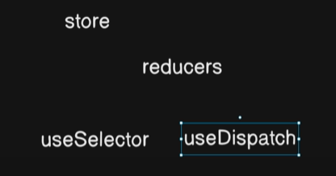
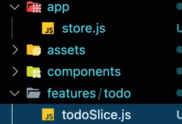
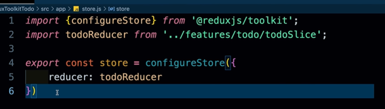
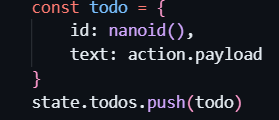
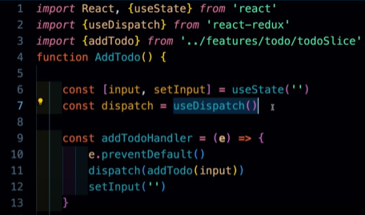
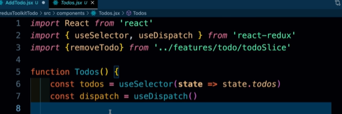

# RTK-Redux-Tool-Kit

- Redux is Core library.
- Wheres React-Redux is a implementation to wiring the Redux with React, so they both can communicate with each other.



  
  

- RTK first start with its store.
  - **app -> store.js**
  - Every RTK implemented Application has only one store.(we can made multiple but always preffered to make a store only.)
  - 'store' also known as 'single source of truth'.
  
    

  - store has `configureStore` which is imported from `@reduxjs/toolkit`
  - `configureStore` contain objects in form of key value pair.
  - `configureStore` could have multiple key value pair, but in above example their is only one key value pair.
  - Inside `configureStore` we introduce all the reducer inside it, in form of key value pair.
  - Why their we have to introduce `reducer` inside `configureStore`
   - Large applications typically have multiple `reducers` to manage different parts of the state. configureStore allows you to combine these reducers into a `single root reducer`, which can then be passed to the `store`.


- Lets know about `reducer`.
  - **features -> todo -> todoSlice.js**
  - its is syntax we call every feature a slice, it could be any name but it is suggested to give name with slice suffix.

  - To Create a slice we use `createSlice` which is again imported from `@reduxjs/toolkit`.
  - To create a slice we need majorly three things
    - name (is is string)
    - intialState (it is a object)
    - reducers (it is list of all reducers)

  - A reducer have to parameter `state` and `action`
    - a state always `initial state` for it
    - Whereas `action` is payload send to it by invoking it.
    - In `addTodo` initial state will be array of object of all todos.
    - And `action` will be a new Todo send to it.
    
    
    
    - Here we get text of todo from `action.payloady` we directly make object using it an uninue `nanoid` which is from again `@reduxjs/toolkit`
    - after it we directly push this todo into our current state to update todos.
    - Here one thing we notice we don't have to use iterator `...` as like we use in context API first itrate over the existing values then push new one.
     
    ```javascript    
      const addTodo = (todo) => {
        setTodos((prev) => [{ id: Date.now(), ...todo }, ...prev]); 
      };
    ```
    - This above thing automatically managed by redux-toolkit.


### Code of reducer

```javascript
import {createSlice, nanoid } from '@reduxjs/toolkit';

const initialState = {
    todos: [{id: 1, text: "Hello world"}]
}


export const todoSlice = createSlice({
    name: 'todo',
    initialState,
    reducers: {
        addTodo: (state, action) => {
            const todo = {
                id: nanoid(), 
                text: action.payload
            }
            state.todos.push(todo)
        },
        removeTodo: (state, action) => {
            state.todos = state.todos.filter((todo) => todo.id !== action.payload )
        },
    }
})

export const {addTodo, removeTodo} = todoSlice.actions

export default todoSlice.reducer

```


  - All reducers must be export because you don't which component will use which reducer

```javascript
export const {addTodo, removeTodo} = todoSlice.actions
```

  - Main soruce of reducer also export due to this use by our store.
```javascript
export default todoSlice.reducer
```

- As last step Wrap the <App/> with provider as like we do into context API.
  - Also provide `store` to this provider.
  - But `provider` is imported from `react-redux`

```javascript
import React from 'react'
import ReactDOM from 'react-dom/client'
import App from './App.jsx'
import './index.css'
import { Provider } from 'react-redux'
import {store} from './app/store'

ReactDOM.createRoot(document.getElementById('root')).render(
  <Provider store={store}>
    <App />
  </Provider>,
)

```


- Now we can use functionality of RTK
 - To send the value to the store we use `useDispatch()`

   

 - To dispatch values to particular reducer we pass import this reducer and pass it into `dispatch` and from their our reducer invoke particular functionality by sending `action` to it, here action is our input.

- To take the values from store we use `useSelector()` this return the current state for particlar slice.
- To store values we have iterate over all the state of it and store in into a new variable

- as like here `todos` is storing all the object from `state` and making a array of object containing all todos.

    

---


## Cache Management with `providesTags` and `invalidatesTags`

RTK Query offers powerful cache management capabilities through the use of `providesTags` and `invalidatesTags`. These tags help manage the cached data efficiently, ensuring your application stays in sync with the server state.

### `providesTags`

When defining a query, you can specify `providesTags` to indicate which tags the query provides. These tags act as identifiers for the data fetched by the query.

**Example:**

```javascript
// Define an API service
const api = createApi({
  reducerPath: 'api',
  baseQuery: fetchBaseQuery({ baseUrl: '/api' }),
  endpoints: (builder) => ({
    getUser: builder.query({
      query: (id) => `user/${id}`,
      providesTags: ['User'],
    }),
    getPosts: builder.query({
      query: () => 'posts',
      providesTags: ['Post'],
    }),
  }),
});

export const { useGetUserQuery, useGetPostsQuery } = api;
```

In this example:
- The `getUser` query provides a `User` tag.
- The `getPosts` query provides a `Post` tag.

### `invalidatesTags`

When performing a mutation, you can specify which tags the mutation invalidates using `invalidatesTags`. This invalidation mechanism marks the queries associated with these tags as stale, prompting a re-fetch to update the store with fresh data.

**Example:**

```javascript
// Extend the API service
const api = createApi({
  reducerPath: 'api',
  baseQuery: fetchBaseQuery({ baseUrl: '/api' }),
  endpoints: (builder) => ({
    addPost: builder.mutation({
      query: (newPost) => ({
        url: 'posts',
        method: 'POST',
        body: newPost,
      }),
      invalidatesTags: ['Post'],
    }),
    updateUser: builder.mutation({
      query: (user) => ({
        url: `user/${user.id}`,
        method: 'PUT',
        body: user,
      }),
      invalidatesTags: ['User'],
    }),
  }),
});

export const { useAddPostMutation, useUpdateUserMutation } = api;
```

In this example:
- The `addPost` mutation invalidates the `Post` tag, causing any queries with this tag to be re-fetched.
- The `updateUser` mutation invalidates the `User` tag, ensuring precise cache invalidation.

### Summary

- **`providesTags`**: Helps identify the data a query fetches. Tags are specified using simple string arrays.
- **`invalidatesTags`**: Ensures relevant queries are re-fetched when mutations occur. Tags are specified using simple string arrays.

By leveraging `providesTags` and `invalidatesTags`, RTK Query efficiently manages cache invalidation and ensures your application always displays up-to-date data.

---

  
 


